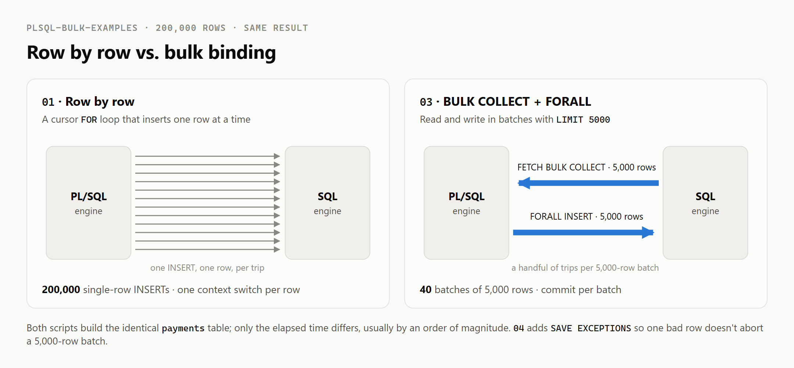

# plsql-bulk-examples

Runnable Oracle PL/SQL scripts showing how to turn a slow, row-by-row routine
into a fast batched one with **`BULK COLLECT`** and **`FORALL`** — and how to keep
one bad row from killing the whole batch with **`SAVE EXCEPTIONS`**.

The single most common performance problem in PL/SQL is not a missing index or a
bad join; it is a loop that processes one row at a time. Each row's SQL statement
is a separate context switch between the PL/SQL and SQL engines, and on a large
table that overhead — not the actual work — becomes the bottleneck. These scripts
demonstrate the fix on a 200,000-row table you can create locally.



## The scripts

Run them in order against any Oracle database (including Oracle XE) with SQL\*Plus,
SQLcl, or SQL Developer.

| File | What it shows |
|------|---------------|
| [`00_setup.sql`](00_setup.sql) | Creates `staging_payments` + `payments` and seeds 200,000 rows. Re-runnable. |
| [`01_slow_row_by_row.sql`](01_slow_row_by_row.sql) | The naive cursor-`FOR`-loop insert — one context switch per row. |
| [`02_bulk_collect.sql`](02_bulk_collect.sql) | Batched **reads** with `BULK COLLECT ... LIMIT 5000`. |
| [`03_bulk_collect_forall.sql`](03_bulk_collect_forall.sql) | Batched reads **and** writes — the same job as `01`, far faster. |
| [`04_save_exceptions.sql`](04_save_exceptions.sql) | Let a batch finish despite bad rows and report each failure. |

## Try it

```sql
@00_setup.sql
SET TIMING ON
@01_slow_row_by_row.sql        -- note the elapsed time
@03_bulk_collect_forall.sql    -- same result, a fraction of the time
```

`01` and `03` produce the identical `payments` table; only the elapsed time
differs — usually by an order of magnitude, because `03` makes a handful of
context switches per 5,000-row batch instead of one per row.

## Key points the scripts illustrate

- **`LIMIT` is not optional.** `BULK COLLECT` without a `LIMIT` loads the entire
  result set into PGA at once. Batching in chunks (5,000 here) keeps memory
  bounded on tables of any size.
- **`%TYPE` anchors.** The collection element types are declared as
  `staging_payments.id%TYPE`, so a column change flows through instead of breaking
  the code.
- **`EXIT WHEN ... COUNT = 0` goes after the fetch**, so the last partial batch is
  still processed before the loop ends.
- **Commit per batch, not per row.**
- **`SAVE EXCEPTIONS`** turns "one bad row aborts 5,000" into "log the few bad
  rows, load the rest."

## When *not* to reach for this

If the whole thing can be a single set-based statement —
`INSERT INTO payments SELECT ... FROM staging_payments` — do that instead; pure
SQL skips the PL/SQL engine entirely and is almost always fastest. `BULK COLLECT`
and `FORALL` earn their keep when you genuinely need procedural logic in the middle
that can't be pushed down into one SQL statement.

## Background

A full write-up of the reasoning is here:
[Speeding Up a Slow PL/SQL Routine with BULK COLLECT and FORALL](https://dev.to/zahid23saim/speeding-up-a-slow-plsql-routine-with-bulk-collect-and-forall-5c0l).

## License

MIT — see [LICENSE](LICENSE).
